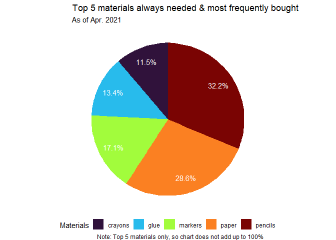
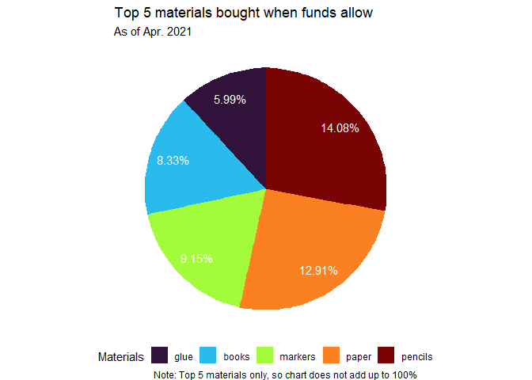
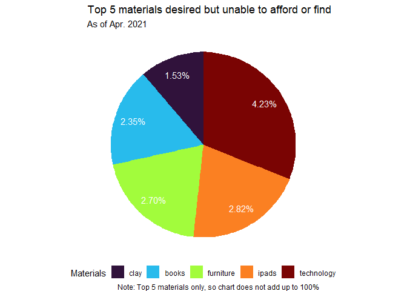
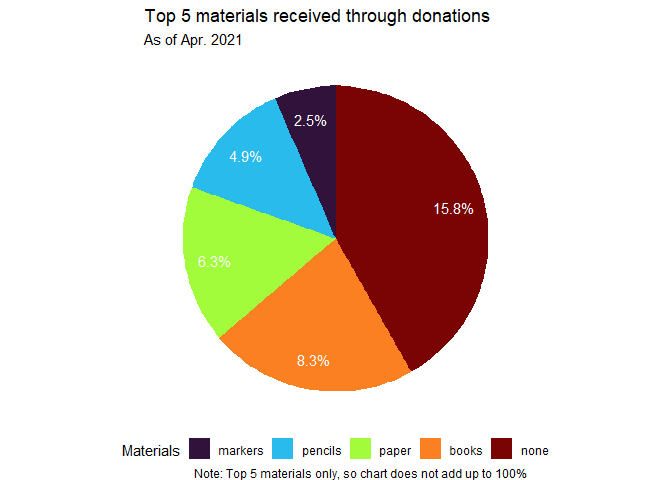
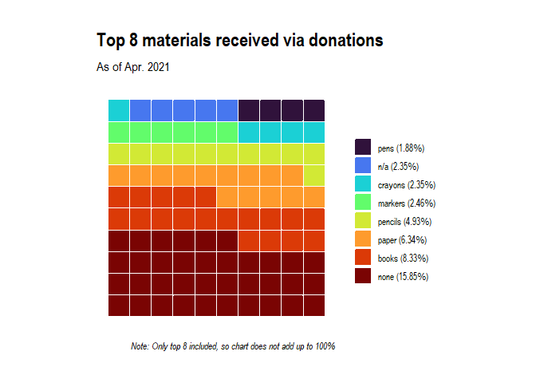

data1
================
Julia Du
2021-05-27

## Load necessary libraries

``` r
library(tidyverse)
library(lubridate)
library(ggrepel)
library(broom)
library(googlesheets4)
library(janitor)
library(viridis)

library(waffle)
library(hrbrthemes)
library(extrafont)
library(ggthemes)

theme_set(theme_minimal())

# https://cran.r-project.org/web/packages/extrafont/README.html
#font_import() - only needs to be done once
loadfonts(device = "win")
```

## Import Fonts

<https://r-coder.com/custom-fonts-r/#Import_the_system_custom_fonts>
Download any fonts & move them to “fonts” folder in R\_projs folder.
Then:

``` r
#font_import(pattern = "Roboto-Condensed") 
```

tried using "C:\_projs" & “./R\_projs/fonts”, but no dice. got same
error message.
<https://stackoverflow.com/questions/59949572/i-cannot-import-fonts-using-font-import>
ended up just moving downloaded fonts to “C:” & used pattern arg in
font\_import. was able to import, but using theme\_ipsum\_rc still
doesn’t work (get “font family not found”)

## Import data

``` r
test <- read_sheet("https://docs.google.com/spreadsheets/d/1EOzWrUxbi6h-fQwcdvLzLyAziyejw3cSYbZWp7WV_1M/edit#gid=113582572", sheet = 2)
```

    ## > Using an auto-discovered, cached token

    ##   To suppress this message, modify your code or options to clearly consent to
    ##   the use of a cached token

    ##   See gargle's "Non-interactive auth" vignette for more details:

    ##   <https://gargle.r-lib.org/articles/non-interactive-auth.html>

    ## > The googlesheets4 package is using a cached token for 'duj@uchicago.edu'

    ## Auto-refreshing stale OAuth token.

    ## Reading from "Copy of 1. Copy of Active:  CCRx Teacher-Material Survey Responses"

    ## Range "'Form Responses 1'"

    ## New names:
    ## * `` -> ...17
    ## * `` -> ...30

``` r
# spreadsheet 1?
# how attendance changes over yrs & at diff locations
```

## Process data

``` r
materials_df <- test %>%
  clean_names() %>%
 # select(15:19, -17) %>%
  rename(
    materials_often = what_materials_do_you_always_need_and_often_have_to_purchase,
    materials_when = what_materials_do_you_purchase_when_you_can,
    materials_dream = what_materials_do_you_dream_of_purchasing_but_cant_usually_afford_or_find,
    materials_donated = what_materials_if_any_do_you_get_donated) %>%
  mutate(materials_dream = sapply(materials_dream, toString),
         materials_donated = sapply(materials_donated, toString)) %>%
  mutate_all(.funs = tolower) 

materials_df %>%
  select(timestamp, materials_often) %>%
  mutate(mat1 = strsplit(materials_often, ",")) %>%
  unnest(mat1) %>%
  mutate(mat1 = str_trim(mat1)) %>% 
  group_by(mat1) %>%
  summarize(count = n()) %>%
  arrange(-count)
```

    ## # A tibble: 1,026 x 2
    ##    mat1               count
    ##    <chr>              <int>
    ##  1 pencils              274
    ##  2 paper                244
    ##  3 markers              146
    ##  4 glue                 114
    ##  5 crayons               98
    ##  6 pens                  66
    ##  7 folders               64
    ##  8 paint                 64
    ##  9 notebooks             58
    ## 10 construction paper    54
    ## # ... with 1,016 more rows

``` r
materials_freq <- function(mat_col, suffix){
  length_df <- materials_df %>%
    count() %>%
    pull()
  
  materials_df %>%
    select(timestamp, {{mat_col}}) %>%
    mutate(mat = strsplit({{mat_col}}, ",")) %>%
    unnest(mat) %>%
    mutate(mat = str_trim(mat)) %>%
    group_by(mat) %>%
    summarize(count = n()) %>%
    mutate(prop = count/length_df) %>%
    arrange(-count) %>%
    mutate(mat = as_factor(mat))
   # rename("mat_{suffix}" := mat)
  #  slice_head(n = 10)
}
```

``` r
mat_piechart <- function(freq5_df){
  freq5_df %>%
    mutate(mat = fct_rev(mat),
           cumulative = cumsum(count),
           midpoint = cumulative - count/2, 
           label = scales::percent(prop)) %>%
    ggplot(aes(x = 1, weight = count, fill = mat)) +
    geom_bar(width = 1, position = "stack") +
    coord_polar(theta = "y") +
    geom_text(aes(x = 1.3, y = midpoint, label = label), color = "white") + 
    scale_fill_viridis(discrete = TRUE, option = "turbo") +
    guides(fill = guide_legend(title = "Materials")) +
    labs(subtitle = "As of Apr. 2021",
         caption = "Note: Top 5 materials only, so chart does not add up to 100%") +
    theme_void() +
    theme(legend.position = "bottom")
}

materials_freq(materials_often) %>%
  slice_head(n = 5) %>%
  mat_piechart() +
  labs(title = "Top 5 materials always needed & most frequently bought")
```

<!-- -->

``` r
materials_freq(materials_when) %>%
  drop_na(mat) %>%
  slice_head(n = 5) %>%
  mat_piechart() +
  labs(title = "Top 5 materials bought when funds allow")
```

<!-- -->

``` r
materials_freq(materials_dream) %>%
  slice_head(n = 5) %>%
  mat_piechart() +
  labs(title = "Top 5 materials desired but unable to afford or find")
```

<!-- -->

``` r
materials_freq(materials_donated) %>%
  slice_head(n = 5) %>%
  mat_piechart() +
  labs(title = "Top 5 materials received through donations")
```

<!-- -->

``` r
mat_waffle <- function(freq5_df){
  freq5_df %>%
    mutate(label = paste0(mat, " (", scales::percent(prop), ")")) %>%
    mutate(label = as_factor(label),
           label = fct_rev(label)) %>%
    ggplot(aes(fill = label, values = count)) +
    geom_waffle(n_rows = 10, size = 0.33, color = "white", flip = TRUE, 
                make_proportional = TRUE, radius = unit(0.5, "pt")) +
    coord_equal() +
    theme_ipsum(grid = "") +
  #theme(legend.position = "bottom") +
  #guides(fill = guide_legend(nrow = 2)) +
    theme_enhance_waffle() +
    scale_fill_viridis(option = "turbo", discrete = TRUE, name = NULL) +
    labs(subtitle = "As of Apr. 2021",
         caption = "Note: Only top 8 included, so chart does not add up to 100%") 
}

often_waffle <- materials_freq(materials_often) %>%
  slice_head(n = 8) %>%
  mat_waffle() +
  labs(title = "Top 8 materials always needed \n& most frequently bought")

ggsave("often_waffle.png", width = 5, height = 5)


when_waffle <- materials_freq(materials_when) %>%
  drop_na(mat) %>%
  slice_head(n = 8) %>%
  mat_waffle() +
  labs(title = "Top 8 materials bought when funds allow")
ggsave("when_waffle.png", width = 5, height = 5)

dream_waffle <- materials_freq(materials_dream) %>%
  slice_head(n = 8) %>%
  mat_waffle() +
  labs(title = "Top 8 materials desired \nbut unable to afford/find")
ggsave("dream_waffle.png", width = 5, height = 5)

colortest <- materials_freq(materials_donated) %>%
  slice_head(n = 8) %>%
  drop_na(mat) %>%
  mat_waffle() +
  labs(title = "Top 8 materials received via donations") 
  

colortest
```

<!-- -->

``` r
#colortest +
 # ggthemes::scale_fill_gdocs(name = NULL)
#colortest +
 # ggthemes::scale_fill_tableau(name = NULL)
#colortest +
 # scale_fill_discrete(name = NULL)

ggsave("colortest.png", width = 5, height = 5)
```

# other possible graphs

``` r
# column graph
materials_freq(materials_often) %>%
  slice_head(n = 10) %>%
  ggplot(mapping = aes(x = mat, y = count, fill = mat, label = count)) +
  geom_col() +
  labs(title = "Materials most often used and bought by teachers", 
       subtitle = "As of Apr. 2021", 
       x = "Materials", y = "Number of teachers", fill = "") +
  geom_label() +
  theme_ipsum() +
  theme(legend.position = "none")  


#waffle graph
#materials_freq(materials_often) %>%
 # slice_head(n = 5) %>%
  
wip %>%
  mutate(label = paste0(mat, " (", scales::percent(prop), ")")) %>%
  ggplot(aes(fill = label, values = count)) +
  geom_waffle(n_rows = 20, size = 0.33, color = "white", flip = TRUE) +
  coord_equal() +
#  theme_ipsum(grid = "") +
  theme(legend.position = "bottom") +
  guides(fill = guide_legend(nrow = 2)) +
  theme_enhance_waffle() +
  ggthemes::scale_fill_tableau(name = NULL) 

wip %>%
  mutate(label = paste0(mat, " (", scales::percent(prop), ")")) %>%
  ggplot(aes(fill = label, values = count)) +
  geom_waffle(n_rows = 10, size = 0.33, color = "white", flip = TRUE, make_proportional = TRUE, radius = unit(0.5, "pt")) +
  coord_equal() +
  theme_ipsum(grid = "") +
  #theme(legend.position = "bottom") +
  #guides(fill = guide_legend(nrow = 2)) +
  theme_enhance_waffle() +
  ggthemes::scale_fill_tableau(name = NULL) +
  labs(title = "Materials most often used and bought by teachers", 
       subtitle = "As of Apr. 2021",
        caption = "Note: Top 5 materials only, so chart does not add up to 100%") 

#top 8 waffle chart
materials_freq(materials_often) %>%
  slice_head(n = 8) %>%
  mutate(mat = fct_rev(mat)) %>% #NEED THIS to order by most freq. NVM IT DOESN'T HELP
  mutate(label = paste0(mat, " (", scales::percent(prop), ")")) %>%
  ggplot(aes(fill = label, values = count)) +
  geom_waffle(n_rows = 10, size = 0.33, color = "white", flip = TRUE, 
              make_proportional = TRUE, radius = unit(0.5, "pt")) +
  coord_equal() +
  theme_ipsum(grid = "") +
  #theme(legend.position = "bottom") +
  #guides(fill = guide_legend(nrow = 2)) +
  theme_enhance_waffle() +
  ggthemes::scale_fill_tableau(name = NULL) +
  labs(title = "Materials most often used and bought by teachers", 
       subtitle = "As of Apr. 2021",
        caption = "Note: Top 8 materials only, so chart does not add up to 100%") 

## ORDERED top 8 waffle plot
materials_freq(materials_often) %>%
  slice_head(n = 8) %>%
  mutate(#mat = fct_rev(mat),
         label = paste0(mat, " (", scales::percent(prop), ")")) %>%
  mutate(label = as_factor(label),
         label = fct_rev(label)) %>%
  ggplot(aes(fill = label, values = count)) +
  geom_waffle(n_rows = 10, size = 0.33, color = "white", flip = TRUE, 
              make_proportional = TRUE, radius = unit(0.5, "pt")) +
  coord_equal() +
  theme_ipsum(grid = "") +
  #theme(legend.position = "bottom") +
  #guides(fill = guide_legend(nrow = 2)) +
  theme_enhance_waffle() +
  ggthemes::scale_fill_tableau(name = NULL) +
  labs(title = "Materials most often used and bought by teachers", 
       subtitle = "As of Apr. 2021",
        caption = "Note: Top 8 materials only, so chart does not add up to 100%") 
```

# helpful links

-   <https://rud.is/rpubs/building-waffle-charts.html>

-   **<https://stackoverflow.com/questions/41338757/adding-percentage-labels-on-pie-chart-in-r>**

-   <https://www.r-graph-gallery.com/piechart-ggplot2.html>

# FUNCTIONING code for graphs (before wrote function)

``` r
# column graph
materials_freq(materials_often) %>%
  slice_head(n = 10) %>%
  ggplot(mapping = aes(x = mat, y = count, fill = mat, label = count)) +
  geom_col() +
  labs(title = "Materials most often used and bought by teachers", 
       subtitle = "As of Apr. 2021", 
       x = "Materials", y = "Number of teachers", fill = "") +
  geom_label() +
  theme(legend.position = "none")

## this works!!! gives % labels
wip <- materials_freq(materials_often) %>%
  slice_head(n = 5) 
wip %>%
  mutate(
    mat = fct_rev(mat),
    cumulative = cumsum(count),
    midpoint = cumulative - count/2, 
    label = scales::percent(prop)) %>%
ggplot(aes(x = 1, weight = count, fill = mat)) +
  geom_bar(width = 1, position = "stack") +
  coord_polar(theta = "y") +
  geom_text(aes(x = 1.3, y = midpoint, label = label), color = "white") + 
  scale_fill_viridis(discrete = TRUE, option = "turbo") +
  guides(fill = guide_legend(title = "Materials")) +
  labs(title = "Top 5 materials most often used and bought by teachers", 
       subtitle = "As of Apr. 2021", 
       x = "Materials", y = "Number of teachers", fill = "") +
  theme_void()
```

``` r
# helpful pie graph, but labels are misplaced
ggplot(aes(x = "", y = count, fill = mat)) +
  geom_bar(width = 1, stat = "identity") +
  coord_polar("y", start = 0) +
  geom_label_repel(aes(label = scales::percent(prop)), size=2, show.legend = F, nudge_x = 3) +
  guides(fill = guide_legend(title = "Materials"))

# old pie graph - labels also misplaced
materials_freq(materials_often) %>%
  slice_head(n = 5) %>%
  mutate(ypos = cumsum(prop)- 0.5*prop ) %>%
  ggplot(aes(x="", y=prop, fill = mat, label = prop)) +
  geom_bar(stat="identity", width=1, color="white") +
  coord_polar("y", start=0) +
  theme_void() + 
  labs(title = "Materials most often used and bought by teachers", 
       subtitle = "As of Apr. 2021", 
       x = "Materials", y = "Number of teachers", fill = "") +
#  theme(legend.position="none") +
  geom_text(aes(y = ypos, label = mat), color = "white", size=5) #+
#  geom_label(aes(y = ypos*.3), size = 2)
```

# can ignore

material\_count &lt;- function(material\_string){ materials\_df %&gt;%
filter(str\_detect(material, material\_string)) %&gt;% count() %&gt;%
mutate(material = material\_string) }
